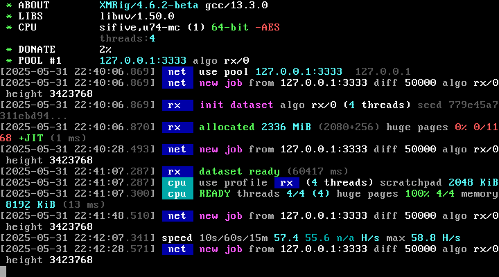
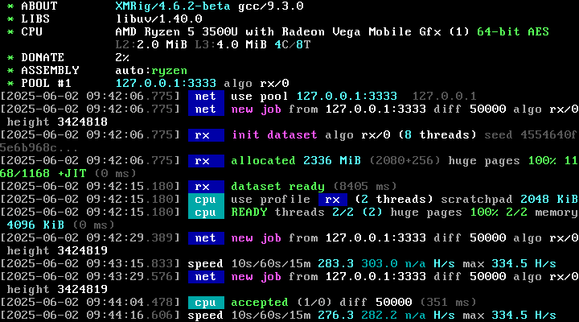
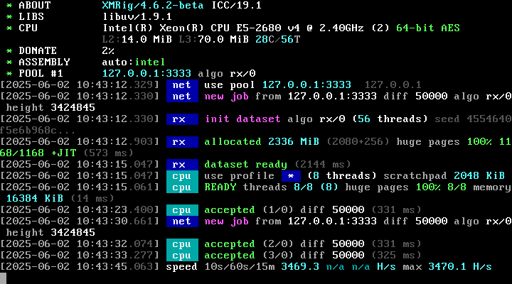

# XMRig

This fork focuses only on RandomX CPU mining, on different CPU architectures and Unix-like operating systems.

## Supported Architectures with RandomX JIT Compiler

* **x86-64**
* **AArch64**
* **64-bit RISC-V**

## Screenshots





## Build

Building for architectures other than x86 and ARM requires **simde** headers, to help getting the currently mandatory CryptoNight code compiled; even if such code is not being used for running RandomX.

This source tree uses **GNU Make** as the build system. You will likely need to set a series of environment variables when running **make(1)**. The available environment variables are:

Environment Variable   | Description
---------------------- | -----------------------------------------------------
`CC`                   | C compiler command name
`CFLAGS`               | Additional flags to pass to C compiler (e.g. `-march=native`)
`CXX`                  | C++ compiler command name
`CXXFLAGS`             | Additional flags to pass to C++ compiler (e.g. `-march=native`)
`LDFLAGS`              | Additional flags to pass during linking
`LIBS`                 | `-l` options for linking with additional libraries
`ARCH`                 | Set target architecture for cross-building
`WITH_HWLOC`           | Set this to enable uses of external hwloc library
`WITH_LIBCPUID`        | Set this to enable uses of bundled libcpuid
`WITH_RANDOMX`         | Set this to enable RandomX algorithm support
`WITH_ARGON2`          | Set this to enable Argon2 algorithm support
`WITH_HTTP`            | Set this to enable HTTP-related features
`WITH_CRYPTONIGHT_ASM` | Set this to include CryptoNight assembly codes
`WITH_RANDOMX_ASM`     | Set this to include RandomX assembly codes that enable JIT compiler
`WITH_RANDOMX_JIT`     | Synonym for `WITH_RANDOMX_ASM`
`WITH_ASM`             | Shortcut for enabling both `WITH_CRYPTONIGHT_ASM` and `WITH_RANDOMX_ASM`

If you get error messages similar to `error: inlining failed in call to always_inline '__m128i _mm_aeskeygenassist_si128(__m128i, int)': target specific option mismatch`, when compiling for x86, add option `-maes` to `CXXFLAGS`.

### Examples

* x86_64-unknown-linux-gnu or x86_64-unknown-freebsd11
```sh
WITH_RANDOMX=1 WITH_ASM=1 WITH_HWLOC=1 WITH_LIBCPUID=1 CC=gcc CFLAGS="-march=ivybridge -g" CXX=g++ CXXFLAGS="-march=ivybridge -g" make -j 16
```

* x86_64-apple-darwin16
```sh
WITH_RANDOMX=1 WITH_ASM=1 WITH_LIBCPUID=1 CC=clang CFLAGS=-march=native CXX=clang++ CXXFLAGS=-march=native make -j 4
```

* riscv64-unknown-linux-gnu
```sh
WITH_RANDOMX=1 WITH_RANDOMX_ASM=1 WITH_HWLOC=1 CC=gcc CFLAGS="-mcpu=sifive-u74 -g" CXX=g++ CXXFLAGS="-mcpu=sifive-u74 -g" make -j 4
```

* powerpc64-unknown-linux-gnu (No RandomX JIT compiler support)
```sh
WITH_RANDOMX=1 WITH_HWLOC=1 CC=gcc CFLAGS="-mcpu=power7 -g" CXX=g++ FLAGS="-mcpu=power7 -g" make -j 8
```
